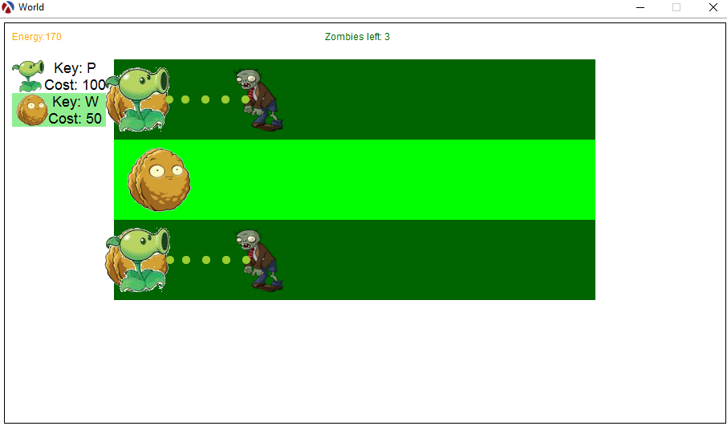

This is the first project from the UDel CISC181 Fall2013 course.
The objective of the project was to create a Racket clone of the
popular game Plants vs. Zombies.

A full description of the project can be found in the included PDF

Below is a screenshot of the game running:

 
